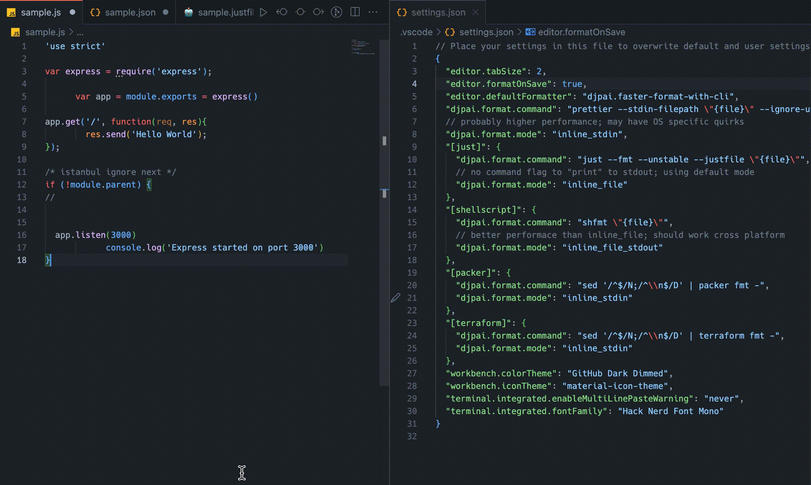

# Faster<sup>[*](#footnote)</sup> Format with CLI
### One extension to format them all!
A simple extension that can support any language, any file type, any formatter and any custom formatter config - all customizable with CLI commands.



> [!TIP]
>
> **Think about it:**
> - Do you really need to bloat your VSCode setup with custom formatters for all the languages you use?
> - Can you customize the config for the formatter in these extensions based on your preferences?
> - How often are these extensions updated?
> - Do they support new features released by the native formatting solution?
> - Do they allow switching to a different formatter ?


- [Faster\* Format with CLI](#faster-format-with-cli)
    - [One extension to format them all!](#one-extension-to-format-them-all)
  - [Features](#features)
  - [Requirements](#requirements)
    - [Optional Requirements](#optional-requirements)
  - [Extension Settings](#extension-settings)
    - [`djpai.format.command`](#djpaiformatcommand)
    - [`djpai.format.mode`](#djpaiformatmode)
    - [Modes](#modes)
      - [`inline_file`](#inline_file)
      - [`inline_file_stdout`](#inline_file_stdout)
      - [`inline_stdin`](#inline_stdin)
      - [`overwrite`](#overwrite)
  - [Known Issues](#known-issues)
  - [Credits](#credits)

## Features

The main feature of this extension is to send file to your cli formatter and update contents with the response.

## Requirements

- Visual Studio Code: ^1.85.0

### Optional Requirements

- `nodejs`: if you are using the default `npx prettier` command for formatting
- any custom commands you use as formatter to be available at `$PATH`

## Extension Settings

> [!NOTE]
>  - Refer the sample VsCode [settings.json sample](samples/.vscode/settings.json) for example usage and [samples/README.md](samples/README.md) for common formatters and languages. Please feel free to raise an [issue](https://github.com/dhananjaipai/vscode-faster-format-with-cli/issues) to document your favorite language/cli command options

**Detailed Example:**
```jsonc
/* settings.json */
{
  // ...

  // Default command that will be executed for all languages.
  "djpai.format.command": "npx prettier --write --ignore-unknown \"{file}\"",
  "djpai.format.mode": "inline_file",

  // Example for command that will only be executed on C# language files.
  "[csharp]": {
    // Use Faster format with cli as the default for this language
    "editor.defaultFormatter": "djpai.faster-format-with-cli",
    // Command to format this file
    "djpai.format.command": "dotnet csharppier \"{file}\"",
    // Disable inline formatting as CSharpier can change the files directly.
    "djpai.format.mode": "overwrite",
    // For overwrite mode, set this to true and do not force formatting on live files to avoid conflicts
    "editor.formatOnSave": true
  }

  // ...
}
```

This extension contributes the following settings:

### `djpai.format.command`
- Set the command for formatting.
- It can contain a placeholder `{file}` that refers to the path of the file to be formatted. IMP! Note that you should generally surround the `{file}` placeholder within double quotes to avoid issues with the path.
- The default value is `npx prettier --write --ignore-unknown "{file}"`.
- This setting can be overridden based on language ID.

### `djpai.format.mode`
- Specify the  [mode](#modes) to communicate with the formatter.
- The way `inputs` and `outputs` are processed differ based on the mode selected. Read below for examples and details on how it works.
- This setting can be overridden based on language ID and based on your command and formatter.

### Modes
There are 4 `modes` supported by the extension to accommodate different CLI tools and how they format the files.

#### `inline_file`
> This is the default mode. This may also be the *slowest*.

**Example:**
```jsonc
// settings.json
{
  // ...

  // Notice the `--write` flag which overwrites the file passed
   "djpai.format.command": "npx prettier --write --ignore-unknown \"{file}\"",
  // write to temp file; reads from overwritten formatted file and updates editor file
  "djpai.format.mode": "inline_file"

  // ...
}
```

**Pros** : This is simple to understand and debug and works how you typically expect it to work when formatting files with CLI. Temp file is created so as to not save/overwrite existing file for formatting!

**Cons** : From a performance perspective, we are doing ~4x Disk/File operations, which are slower.

<details>
<summary> How it works </summary>

The extension **writes** the current file contents into a temporary file and this is then passed to the CLI command for formatting. `It expects the formatter command to overwrite the temporary file` which is then **read** to update the current file.

</details>

<details>
<summary> Order of Operations </summary>

1. [Extn] Read Editor Content
2. [Extn] Temp File Write
3. [Extn] Call Formatter
4. [Formatter] Temp File Read
5. [Formatter] **Format**
6. [Formatter] Temp File Write
7. [Extn] Temp File Read
8. [Extn] Update Editor Content

</details>

#### `inline_file_stdout`
> This is _faster_ than the default mode, but expects the formatter to print the formatted contents into stdout.

**Example:**
```jsonc
// settings.json
{
  // ...

  // Notice that there is no `--write` flag which prints formatted file to stdout
  "djpai.format.command": "npx prettier --ignore-unknown \"{file}\"",
  // write to temp file; reads from stdout and updates editor file
  "djpai.format.mode": "inline_file_stdout"

  // ...
}
```

**Pros** : This is relatively simple to understand and debug and works how you typically expect it to work, if the formatter allows a flag/defaults to not overwrite the input file. Temp file is created so as to not save/overwrite existing file for formatting!

**Cons** : From a performance perspective, we are doing ~2x Disk/File operations.

<details>
<summary> How it works </summary>

The extension **writes** the current file contents into a temporary file and this is then passed to the CLI command for formatting. `It expects the formatter command to print formatted file to stdout` which is then **read** to update the current file.

</details>

<details>
<summary> Order of Operations </summary>

1. [Extn] Read Editor Content
2. [Extn] Temp File Write
3. [Extn] Call Formatter
4. [Formatter] Temp File Read
5. [Formatter] **Format**
6. [Formatter] Prints to stdout
7. [Extn] Read from stdout
8. [Extn] Update Editor Content

</details>

#### `inline_stdin`
> This is _fastest_ inline solution, but expects the formatter to be able to read from stdin and print the formatted contents into stdout.

> [!WARNING]
> - DO NOTE THAT this is only tested in unix shells with `cat` and _may not work as expected in CMD/Powershell terminal_ because of the way contents are currently piped into the command. Please [raise an issue](https://github.com/dhananjaipai/vscode-faster-format-with-cli/issues)/submit a PR if you could help test.

**Example:**
```jsonc
// settings.json
{
  // ...

// Notice that there is no `--write` flag and the `--stdin-filepath` flag expects input from stdin and prints formatted file to stdout
  // PS: the --stdin-filepath is a misnomer; there is no actual file being generated, its just a flag to give a pseudo-name for the stdin
  "djpai.format.command": "npx prettier --stdin-filepath \"{file}\" --ignore-unknown",
  // write to stdin; reads from stdout and updates editor file
  "djpai.format.mode": "inline_stdin"

  // ...
}
```

**Pros** : Since there is no file read/write this should _theoretically_ be the fastest.

**Cons** : echo/printing the entire file contents to console through javascript _may_ be slower than a native read through CLI. Needs more testing/feedbacks. Depends a lot on the capability of the formatter. Might tougher to understand and write the command.

<details>
<summary> How it works </summary>

The extension `cat`s the current file contents using HEREDOC strings and `|` pipes it to your command for formatting. `It expects the formatter command to read from stdin and print formatted file contents to stdout` which is then **read** to update the current file.

</details>

<details>
<summary> Order of Operations </summary>

1. [Extn] Read Editor Content
2. [Extn] Call Formatter with file contents piped
3. [Formatter] **Format**
4. [Formatter] Prints to stdout
5. [Extn] Read from stdout
6. [Extn] Update Editor Content

</details>

#### `overwrite`
> This mode is only recommended if the formatter can *only* overwrite the original file and you find the default `inline_file` mode too slow.

> [!WARNING]
> - DO NOTE THAT this is only advised to be used along with `editor.formatOnSave` setting so that the source file is not overwritten by formatter and cause conflicts with the file open in the editor.

**Example:**
```jsonc
// settings.json
{
  // ...

  // Notice the `--write` flag which overwrites the file passed
   "djpai.format.command": "npx prettier --write --ignore-unknown \"{file}\"",
  // passes original file to formatted; reads from overwritten file ; vscode automatically reloads the file
  "djpai.format.mode": "overwrite"

  // ...
}
```

**Pros** : This has the least number of steps, and should be technically the fastest.

**Cons** : Can create conflicts if you format without saving file.

<details>
<summary> How it works </summary>

The extension passes the current file to your command for formatting. `It expects the formatter command to overwrite the original file`. VSCode reloads the file.

</details>

<details>
<summary> Order of Operations </summary>

1. [Extn] Call Formatter with file
2. [Formatter] **Format**
3. [Formatter] Write back to file
4. [VSCode] Refresh file

</details>

## Known Issues

> [!NOTE]
>
> - You may want to add `*format-with-cli.tmp*` into the `.*ignore` files in case the extension fails to delete the tmp file after formatting. However, since some formatters like `prettier` ignore files in `.gitignore`, verify this before raising an issue.

> [!TIP]
> - Use `Developer: Set Log Level...` command to set the level to `Debug` to get additional logs from the output channel `fasterFormatWithCLI` for debugging

- Language `[jsonc] - JSON with comments` not supported due to [issues with VSCode settings.json](https://github.com/dhananjaipai/vscode-faster-format-with-cli/issues/3)

- Only supports working with files that are present on the filesystem - ie, `New` files that have never been saved will not be formatted.
- When using the `overwrite` mode, the file should be saved before formatting, or can cause conflicts - since CLI overwrites the source file. Recommendation is to use `overwrite` mode only with `editor.formatOnSave = true` Setting.

## Credits

- Heavily borrowed from [AkiraVoid Format with CLI](https://github.com/AkiraVoid-Productions/vscode-extension-format-with-cli).  
  The upstream solution is well made. I wanted to make the solution a bit more advanced with additional modes, improve documentation and add some presets for common languages.  
  Recreated it from scratch to use `javascript` over typescript for faster local debugging and opinionated changes to the source code.
- Extension Icon by [Freepik](https://www.freepik.com/icon/right-indent_1833950#fromView=resource_detail&position=20)


---

<a name="footnote">*</a> With the `inline_stdin` mode, since we reduce the disk I/O by piping editor content to the cli formatter without any synchronous file writes/reads, it will be technically faster than file I/O based solutions